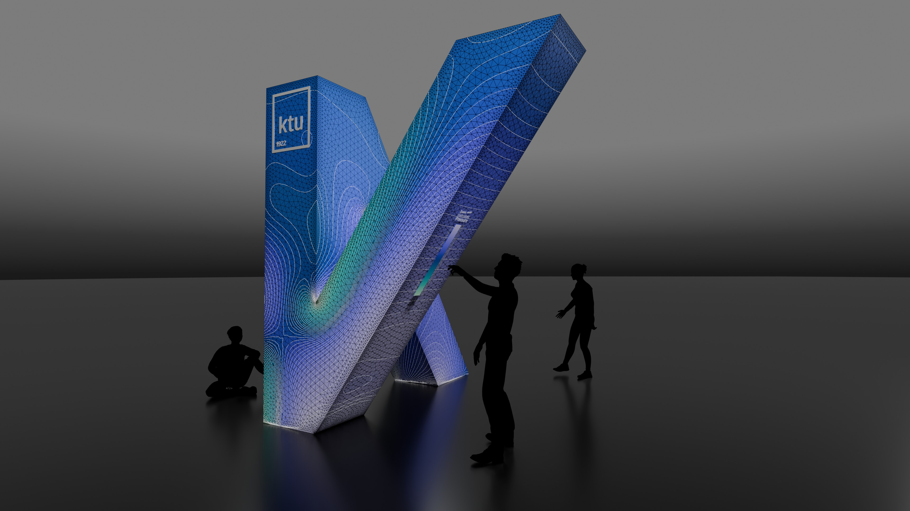
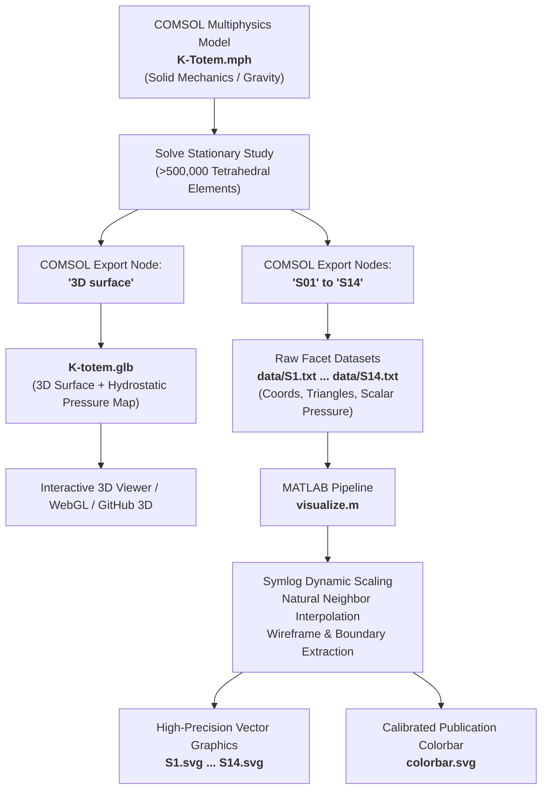

# K-Totem: Beauty Under Pressure

### Computational Solid Mechanics & Data-Driven Visualization Pipeline

[](https://www.comsol.com/)
[](https://www.mathworks.com/products/matlab.html)
[]()
[](https://creativecommons.org/licenses/by/4.0/)

---

## Overview



**K-Totem: *Beauty Under Pressure*** is a data-driven computational engineering and public art installation located at the **Faculty of Mechanical Engineering and Design (MIDF)**, Kaunas University of Technology (KTU), Lithuania.

Originally erected as a 3.5-metre-tall monument celebrating international collaboration between the UNESCO Cities of Design (Kaunas and Kortrijk, Belgium), the sculpture’s exterior surface has been re-engineered into an explicit, quantitative visualization of its internal structural mechanics.

Using **Finite Element Analysis (FEA)** in **COMSOL Multiphysics**, the continuous geometry is discretized into over 500,000 volumetric solid elements under gravitational self-weight loading. The resulting **internal hydrostatic pressure field** (mean normal stress) is extracted across 14 discrete planar boundary facets and mapped using a custom symmetrical logarithmic (**symlog**) scale.

This repository provides the complete open-science pipeline required to reproduce the numerical simulation, export raw surface datasets and 3D glTF/GLB geometry, and synthesize publication-ready vector graphics (`.svg`) via MATLAB.


---

## Pipeline Architecture



---

## Repository Structure

All simulation projects, scripts, 3D models, images, and generated vector files reside in the root directory, with raw text datasets organized in `data/`:

```text
.
├── data/
│   ├── S1.txt                   # COMSOL raw mesh & pressure data for Facet 01
│   ├── S2.txt                   # COMSOL raw mesh & pressure data for Facet 02
│   ├── ...                      # (Facets S03 through S13)
│   └── S14.txt                  # COMSOL raw mesh & pressure data for Facet 14
├── K-Totem.mph                  # Master COMSOL Multiphysics FEA simulation model
├── K-totem.glb                  # Exported 3D surface model (glTF/GLB) with mapped pressure
├── visualize.m                  # MATLAB pipeline: processes data/*.txt into scaled SVGs
├── K-totem.jpg                  # Rendered image / photo of the installation
├── colorbar.svg                 # Standalone 50-band calibrated vector colorbar
├── S1.svg ... S14.svg           # Generated 2D vector facets with mesh & contour lines
└── README.md                    # Project documentation & reproduction guide
```

---

## Mechanics & Mathematical Formulation

### 1. Solid Mechanics Governing Equations

The static structural equilibrium of the sculpture is governed by the Cauchy momentum equation in the absence of dynamic effects:

$$\nabla \cdot \boldsymbol{\sigma} + \mathbf{f}_{\mathrm{g}} = \mathbf{0}$$

where $\boldsymbol{\sigma}$ is the Cauchy stress tensor and $\mathbf{f}_{\mathrm{g}} = \rho \mathbf{g}$ represents the volumetric body load due to gravity ($g = 9.81\,\mathrm{m/s}^2$). The material is treated as an isotropic homogeneous linear elastic continuum:

$$\boldsymbol{\sigma} = \mathbf{C} : \boldsymbol{\varepsilon} = \lambda \mathrm{tr}(\boldsymbol{\varepsilon}) \mathbf{I} + 2\mu \boldsymbol{\varepsilon}$$

$$\boldsymbol{\varepsilon} = \frac{1}{2}\left[\nabla \mathbf{u} + (\nabla \mathbf{u})^{\mathrm{T}}\right]$$

### 2. Hydrostatic Pressure Field

Rather than displaying equivalent von Mises stress (which is non-negative and conceals the sign of volumetric deformation), the surface design maps the **hydrostatic pressure** $p$, defined as the negative mean normal stress:

$$p = -\frac{1}{3}\mathrm{tr}(\boldsymbol{\sigma}) = -\frac{1}{3}(\sigma_{xx} + \sigma_{yy} + \sigma_{zz})$$

* **$p > 0$ (Compression):** Downward self-weight compacts the geometry, prevailing near the ground support base and lower cantilevers.
* **$p < 0$ (Tension):** Overhanging sections and upper cantilever corners experience volumetric dilation.
* **$p \approx 0$ (Neutral Transition):** Transition trajectories where mean normal stress crosses zero.

### 3. Symmetrical Logarithmic (SymLog) Transformation

Because local stress concentrations around sharp re-entrant corners produce values orders of magnitude larger than the broad baseline distribution, linear colormaps saturate. To maintain full dynamic resolution across both compression and tension without losing zero-crossing fidelity, a symmetrical logarithmic transformation is applied:

$$\tilde{p} = \mathrm{sign}(p) \cdot \ln\left(1 + \frac{|p|}{s_0}\right)$$

where $s_0 = 1.0 \times 10^5\,\mathrm{Pa}$ (100 kPa) represents the linear-to-logarithmic transition threshold.

Values are scaled symmetrically to $[-2.0, +2.0]$ and discretized into **50 distinct color intervals**.

### 4. Color Palette & Semiotics

The colormap is smoothly interpolated in HSV color space across 11 keyframe anchors:

| Hydrostatic State | Normalized Value | Dominant Color | Aesthetic / Mechanical Meaning |
| :--- | :---: | :---: | :--- |
| **Volumetric Compression** | $+0.05 \text{ to } +1.0$ | **Indigo** (`#4544d8` $\to$ `#e1dbff`) | High load-bearing compressive zones |
| **Neutral Transition** | $\approx 0.0$ | **Deep Blue** (`#003f9d`) | Zero mean normal stress pathways |
| **Volumetric Tension** | $-0.05 \text{ to } -1.0$ | **Turquoise** (`#006ca2` $\to$ `#b5ebcd`) | Tensile overhangs and bending inflection |

---

## Data Reproduction Guide

### Part 1: Solving the Model in COMSOL Multiphysics

1. Open `K-Totem.mph` (in the repository root) in **COMSOL Multiphysics 6.x** (or newer).
2. Inspect the **Solid Mechanics (`solid`)** physics interface:
   * **Domain:** Homogeneous 3D volumetric domain representing the full 3.5 m sculpture.
   * **Body Force:** Gravity active in the negative vertical axis.
   * **Boundary Condition:** Fixed constraint on the bottom contact face.
   * **Mesh:** Physics-controlled fine tetrahedral mesh (>500,000 domain elements).
3. Under **Study 1**, click **Compute** (`F8`) to solve the stationary mechanical equilibrium.

---

### Part 2: Exporting the 3D Interactive Model (`.glb`)

To generate the 3D surface model with baked hydrostatic pressure values:

1. In the COMSOL Model Builder tree, expand **Results** $\to$ **Export**.
2. Locate the pre-configured export node named **`3D surface`**.
3. In the **Settings** window for `3D surface`:
   * **Target format:** GLB / glTF (`.glb`).
   * **Expression:** Hydrostatic pressure (`solid.pm` or `-solid.I1/3`).
   * **Coloring:** Custom colormap or vertex color attributes.
4. Set the output file path to `K-totem.glb` in the repository root.
5. Click **Export** at the top of the Settings window.

---

### Part 3: Exporting the 2D Facet Text Datasets (`S01` to `S14`)

The outer faceted shell of the K-Totem consists of 14 key boundary panels. Each panel is exported as a standalone 2D unstructured triangular mesh dataset with nodal scalar values.

1. In the COMSOL Model Builder tree, navigate to **Results** $\to$ **Export**.
2. Under **Export**, locate the 14 individual 2D export nodes labeled **`S01`** through **`S14`**.
3. Each node is configured to extract:
   * **Data Type:** Coordinates, triangular connectivity, and field expression ($p$).
   * **Geometry:** Boundary selection corresponding to that individual facet.
   * **Output format:** Text file (`.txt`), semicolon or whitespace delimited.
4. Set the target file paths to `data/S1.txt` ... `data/S14.txt`.
5. Select each node and click **Export** (or right-click **Export** and choose **Export All**).

#### Structure of the Exported `.txt` Files

Each text file conforms to the standard COMSOL export specification:

```text
% Model:              K-Totem.mph
% Version:            COMSOL 6.4.0.293
% Dimension:          2
% Nodes:              2644
% Elements:           4768
% Expressions:        1
% Description:        Pressure
% Length unit:        m
% Coordinates
-0.01432;-1.86439
...
% Elements (triangles)
1;4;5
...
% Data
-142850.2
...
```

---

### Part 4: Generating Vector Graphics with MATLAB

The MATLAB script `visualize.m` reads the raw COMSOL text files from `data/`, executes the planar coordinate rotations, applies the symlog scaling, performs natural neighbor interpolation onto a regular grid with outer bleed margins, and renders publication-ready vector SVGs overlaid with the computational mesh wireframe.

#### 1. Requirements

* **MATLAB R2020b or later** (base MATLAB; requires no specialized toolboxes).
* Standard graphics export engine (`-dsvg`).

#### 2. Configuration Parameters

Key settings in `visualize.m`:

```matlab
% Directory configuration:
input_dir        = 'data/';        % Input directory containing S1.txt ... S14.txt
output_dir       = '.';            % Output directory for SVGs (current directory)

% List of dataset prefixes to process:
filenames = {'S1', 'S2', 'S3', 'S4', 'S5', 'S6', 'S7', 'S8', 'S9', 'S10', 'S11', 'S12', 'S13', 'S14'};

% Planar rotation angles [deg] to align unfolded facets for fabrication:
rotations = 35 * [0, 1, 0, 0, 1, 0, -1, -1, 0, 0, 0, 0, 0, 0];

% Scaling & contour resolution:
apply_symlog    = true;    % Apply symmetrical logarithmic transformation
refinement      = 1e5;     % Linear-to-logarithmic threshold s0 [Pa]
cmax            = 2.0;     % Clamped range [-2.0, +2.0]
numLevels       = 50;      % 50 discrete contour bands

% Discretization & Bleed Margin:
grid_resolution = 0.01;    % 1 cm interpolation resolution
margin_cm       = 1.0;     % 1 cm bleed margin for fabrication wrap-around
```

#### 3. Execution

In MATLAB, ensure the current folder is the repository root and run:

```matlab
visualize
```

#### 4. Visualization Algorithm Details

1. **Coordinate Transformation:** Rotates planar coordinates by the panel-specific fabrication angle $\theta$.
2. **Dynamic Scaling:** Computes $\tilde{p}_i = \mathrm{sign}(p_i) \cdot \ln(1 + |p_i| / 10^5)$.
3. **Bleed Domain Interpolation:** Computes the bounding box expanded by a 1 cm margin. Natural neighbor interpolation (`scatteredInterpolant(..., 'natural', 'nearest')`) evaluates interior points smoothly while nearest-neighbor extrapolates into the bleed margin to avoid NaN boundaries.
4. **Triangular Wireframe & Boundary Extraction:**
   * Uses `triplot(elements, x, y)` to overlay the black FEA mesh lines (`LineWidth = 6.0 pt`).
   * Uses `triangulation` and `freeBoundary` to identify and render the structural outer perimeter contour.
5. **Colorbar Synthesis:** If `export_colorbar = true`, constructs a standalone normalized colorbar figure (`colorbar.svg`) with exact numerical tick intervals.

#### 5. Generated Outputs

* **`S1.svg` to `S14.svg`:** Vector graphic files representing each panel, dimensioned to true physical proportions.
* **`colorbar.svg`:** High-precision vector legend showing the 50 discrete contour steps normalized from $-1.0$ to $+1.0$.

---

## Technical Specifications Summary

| Parameter | Specification | Notes |
| :--- | :--- | :--- |
| **Sculpture Dimensions** | $3.5\,\mathrm{m} \times 1.8\,\mathrm{m} \times 0.6\,\mathrm{m}$ | Full-scale outdoor installation |
| **FEA Solver** | COMSOL Multiphysics 6.x | Solid Mechanics / Stationary Study |
| **Discretization** | $> 500,000$ 3D elements | Physics-controlled fine tetrahedral mesh |
| **Field Variable** | Hydrostatic Pressure $p$ | $p = -\frac{1}{3}\mathrm{tr}(\boldsymbol{\sigma})$ |
| **Dynamic Range** | $\sim -5 \times 10^6\,\mathrm{Pa} \text{ to } +5 \times 10^6\,\mathrm{Pa}$ | Symmetrical log scaled with $s_0 = 10^5\,\mathrm{Pa}$ |
| **Color Bands** | 50 discrete levels | Smooth HSV-interpolated custom colormap |
| **2D Facets** | 14 discrete planar panels | Extracted via COMSOL nodes `S01`–`S14` |
| **Interpolation** | Natural neighbor (1 cm resolution) | Nearest-neighbor outer bleed extrapolation |
| **Export Formats** | `.glb` (3D surface), `.svg` (Vector), `.txt` (Raw) | Open reproducible formats |

---

## Citation & Academic Credits

If you use the 3D model, simulation files, or visualization code in your academic work, exhibitions, or teaching, please cite:

```bibtex
@misc{moussavi2026ktotem,
  author       = {Maziar Moussavi},
  title        = {K-Totem: Beauty Under Pressure -- Computational Solid Mechanics and Data Visualization},
  institution  = {Institute of Materials Science, Kaunas University of Technology (KTU)},
  year         = {2026},
  howpublished = {\url{https://github.com/your-username/k-totem}}
}
```

* **Concept, Computational Modeling & Visualization:**  
  **Maziar Moussavi**, PhD Researcher, Institute of Materials Science, Kaunas University of Technology (KTU).
* **Location:**  
  Faculty of Mechanical Engineering and Design (MIDF), Kaunas University of Technology, Kaunas, Lithuania.
* **Original Structure Heritage:**  
  Legacy project of *"Kaunas – European Capital of Culture 2022"*, created in partnership with UNESCO Cities of Design (Kaunas & Kortrijk).

---

## License

* **Code & Scripts (`visualize.m`):** Licensed under the [MIT License](https://opensource.org/licenses/MIT).
* **Data, 3D Assets & Graphics (`.mph`, `.glb`, `.txt`, `.svg`):** Licensed under [Creative Commons Attribution 4.0 International (CC BY 4.0)](https://creativecommons.org/licenses/by/4.0/).
